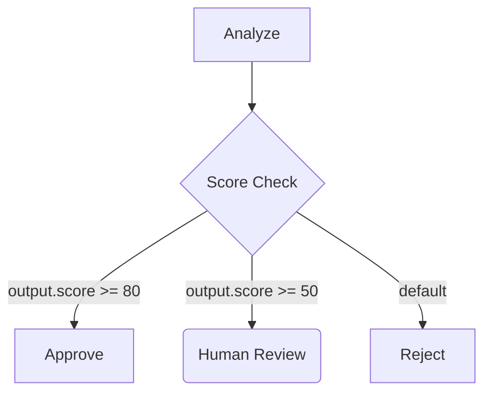
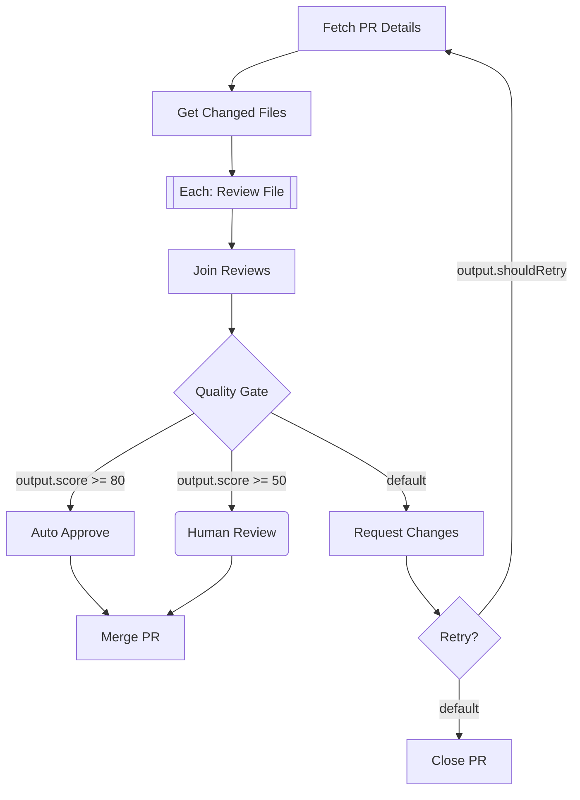

# AI Prompt Architecture & Pipeline Automation

This document explores options for structuring AI prompts, automating task progression through workflows, and handling complex branching scenarios.

---

## Current State (As Implemented)

### Existing Types

**TaskStatus** (`backend/src/types/index.ts:7-12`):
```typescript
export type TaskStatus = 'pending' | 'in_progress' | 'on_hold' | 'completed' | 'cancelled';
```

**Task** (`backend/src/types/index.ts:16-47`):
```typescript
export interface Task {
  _id: ObjectId;
  title: string;
  summary?: string;
  extraPrompt?: string;           // Primary AI instruction field
  additionalInfo?: string;        // Context storage, receives AI responses
  status: TaskStatus;
  urgency?: Urgency;
  parentId: ObjectId | null;
  workflowId?: ObjectId | null;
  workflowStage?: string;
  assigneeId?: ObjectId | null;
  tags?: string[];
  // ... timestamps
}
```

**User** (`backend/src/types/index.ts:183-195`):
```typescript
export type UserRole = 'admin' | 'operator' | 'reviewer' | 'viewer';

export interface User {
  _id: ObjectId;
  email: string;
  displayName: string;
  role: UserRole;
  isActive: boolean;
  teamIds?: ObjectId[];
  preferences?: Record<string, unknown>;
  // ... timestamps
}
```

**WorkflowStep** (`backend/src/routes/workflows.ts:8-15`):
```typescript
interface WorkflowStep {
  id: string;
  name: string;
  type: 'automated' | 'manual';   // Execution mode (human vs AI)
  hitlPhase: string;
  description?: string;
  config?: Record<string, unknown>;
}
```

### Current Daemon Behavior (`scripts/task-daemon.mjs`)

The daemon currently:
1. Polls a saved view for pending tasks
2. Uses `extraPrompt` as main instruction (if present)
3. Appends task context (title, summary, tags, additionalInfo)
4. Executes Claude and stores results in `additionalInfo`
5. Sets status to `completed` on success, `on_hold` on failure

---

## Proposed Architecture

### Core Principle

**AI produces structured output → Daemon routes deterministically**

Decision nodes are not tasks. They are pure routing constructs evaluated synchronously by the daemon after a task completes. The AI never "chooses a branch"—it does work and produces output, then conditions on that output determine the path forward.

```
┌─────────────────┐     ┌─────────────────┐     ┌─────────────────┐
│   Task Node     │────▶│  Decision Node  │────▶│   Task Node     │
│   (AI runs)     │     │  (pure routing) │     │   (AI runs)     │
│                 │     │                 │     │                 │
│  Produces JSON  │     │  Evaluates      │     │                 │
│  output         │     │  conditions     │     │                 │
└─────────────────┘     └─────────────────┘     └─────────────────┘
                              │
                              ▼
                        No task created here
                        Just routing logic
```

---

## Schema Changes Required

### 1. TaskStatus (Add `waiting` and `failed`)

```typescript
// backend/src/types/index.ts
export type TaskStatus =
  | 'pending'
  | 'in_progress'
  | 'waiting'        // NEW: Waiting for child tasks (foreach, subflow)
  | 'on_hold'
  | 'completed'
  | 'failed'         // NEW: Execution failed (distinct from on_hold)
  | 'cancelled';
```

**Status Transitions:**
```
pending ──▶ in_progress ──▶ completed
                │                │
                ▼                ▼
            waiting ◀────── [spawn children]
                │
                ▼
          [children complete]
                │
                ▼
            completed

in_progress ──▶ failed (on error)
in_progress ──▶ on_hold (needs human intervention)
```

### 2. User (Add Agent Fields)

```typescript
// backend/src/types/index.ts
export interface User {
  _id: ObjectId;
  email: string;
  displayName: string;
  role: UserRole;
  isActive: boolean;
  isAgent?: boolean;              // NEW: Is this user an AI agent?
  agentPrompt?: string;           // NEW: Agent's base prompt/persona
  teamIds?: ObjectId[];
  preferences?: Record<string, unknown>;
  createdAt: Date;
  updatedAt?: Date;
}
```

**UI Changes:**
- Add "Is Agent" checkbox in user form
- Show `agentPrompt` textarea when `isAgent` is checked
- Agent users can be assigned to tasks like regular users

**Use Cases:**
- Different agents for different domains (code review, documentation, testing)
- Agent personas with specific expertise or constraints
- Easy to swap agents on workflows

### 3. WorkflowStep (Extended Schema)

```typescript
// backend/src/routes/workflows.ts

// Step types for workflow routing
type WorkflowStepType = 'task' | 'decision' | 'foreach' | 'join' | 'subflow';

// Execution mode (only applicable to 'task' type)
type ExecutionMode = 'automated' | 'manual';

interface DecisionBranch {
  condition: string | null;       // null = default branch
  targetStepId: string;
}

interface WorkflowStep {
  id: string;
  name: string;

  // Step classification
  stepType: WorkflowStepType;     // NEW: What kind of step
  execution?: ExecutionMode;      // Replaces old 'type' field, only for stepType='task'

  // Existing fields (kept for compatibility)
  type?: 'automated' | 'manual';  // DEPRECATED: Use execution instead
  hitlPhase: string;
  description?: string;
  config?: Record<string, unknown>;

  // NEW: Prompt field for AI execution
  prompt?: string;

  // NEW: Default assignee for this step
  defaultAssigneeId?: string;

  // NEW: Decision routing (only for stepType='decision')
  branches?: DecisionBranch[];
  defaultBranch?: string;

  // NEW: ForEach configuration (only for stepType='foreach')
  itemsPath?: string;             // JSONPath to array in output: "output.files"
  itemVariable?: string;          // Template variable name: "file"

  // NEW: Join configuration (only for stepType='join')
  awaitTag?: string;              // Tag pattern: "foreach:{{parentId}}"

  // NEW: Subflow configuration (only for stepType='subflow')
  subflowId?: string;
  inputMapping?: Record<string, string>;
}
```

**Step Types:**

| Type | Creates Task? | Purpose |
|------|---------------|---------|
| `task` | Yes | AI or human performs work |
| `decision` | No | Routes based on previous output |
| `foreach` | Yes (multiple) | Spawns a task per item in array |
| `join` | Yes | Waits for parallel tasks, aggregates results |
| `subflow` | Yes | Delegates to another workflow |

---

## Prompt Layering System

Prompts are assembled from multiple sources in this order:

```
┌─────────────────────────────────────────────────────────────┐
│                    ASSEMBLED PROMPT                          │
├─────────────────────────────────────────────────────────────┤
│  1. Base Daemon Prompt (system-level)                       │
│     - Ensures parsable output format                        │
│     - Defines response structure                            │
│                                                             │
│  2. Agent Prompt (user-level)                               │
│     - Agent's role, capabilities, constraints               │
│     - Persona and behavior guidelines                       │
│                                                             │
│  3. Workflow Step Prompt (workflow-level)                   │
│     - Step-specific instructions                            │
│     - Expected outputs for this stage                       │
│                                                             │
│  4. Task Prompt (task-level)                                │
│     - extraPrompt: specific instructions                    │
│     - Task context: title, summary, tags, additionalInfo    │
└─────────────────────────────────────────────────────────────┘
```

### Base Daemon Prompt

**Purpose:** Ensure consistent, parsable responses that can be saved automatically.

**Proposed Structure:**
```markdown
You are a task automation agent. Your response MUST follow this exact format:

## Status
[SUCCESS | PARTIAL | BLOCKED | FAILED]

## Summary
[1-2 sentence summary of what was accomplished]

## Output
[Main response content - the actual work product]

## Next Action
[COMPLETE | CONTINUE | ESCALATE | HOLD]
- If CONTINUE: Describe what the next task should be
- If ESCALATE: Explain why human intervention is needed
- If HOLD: Specify what you're waiting for

## Metadata
```json
{
  "confidence": 0.0-1.0,
  "suggested_tags": ["tag1", "tag2"],
  "suggested_next_stage": "stage_name_or_null"
}
```
```

**Benefits:**
- Daemon can parse status and determine task state
- Auto-advance workflows based on `suggested_next_stage`
- Track confidence for human review thresholds
- Structured data for analytics

### Prompt Assembly Implementation

```typescript
// scripts/task-daemon.mjs - Updated buildPrompt function

const BASE_DAEMON_PROMPT = `You are a task automation agent. Your response MUST follow this exact format:

## Status
[SUCCESS | PARTIAL | BLOCKED | FAILED]

## Summary
[1-2 sentence summary of what was accomplished]

## Output
[Main response content - the actual work product]

## Next Action
[COMPLETE | CONTINUE | ESCALATE | HOLD]

## Metadata
\`\`\`json
{
  "confidence": 0.0-1.0,
  "suggested_tags": [],
  "suggested_next_stage": null
}
\`\`\`
`;

function assemblePrompt(task, agent, workflowStep) {
  const parts = [];

  // 1. Base daemon prompt (ensures parsable output)
  parts.push(BASE_DAEMON_PROMPT);

  // 2. Agent prompt (persona, capabilities)
  if (agent?.agentPrompt) {
    parts.push(`## Agent Context\n${agent.agentPrompt}`);
  }

  // 3. Workflow step prompt (stage-specific instructions)
  if (workflowStep?.prompt) {
    parts.push(`## Workflow Step: ${workflowStep.name}\n${workflowStep.prompt}`);
  }

  // 4. Task-specific prompt
  if (task.extraPrompt) {
    parts.push(`## Task Instructions\n${task.extraPrompt}`);
  }

  // 5. Task context
  parts.push(`## Task Context
**Title:** ${task.title}
**Summary:** ${task.summary || 'N/A'}
**Tags:** ${task.tags?.join(', ') || 'None'}
**Additional Info:** ${task.additionalInfo || 'None'}`);

  return parts.join('\n\n---\n\n');
}
```

---

## Mermaid Visualization & Configuration

### Node Shapes by Type

| Step Type | Mermaid Syntax | Example |
|-----------|----------------|---------|
| Automated Task | `[Square brackets]` | `A[Analyze Code]` |
| Manual Task | `(Parentheses)` | `B(Human Review)` |
| Decision | `{Curly braces}` | `C{Quality Gate}` |
| ForEach | `[[Double brackets]]` | `D[[Each: Process File]]` |
| Join | `[Square]` with join label | `E[Join Results]` |
| Subflow | `[[Run: Name]]` | `F[[Run: Security Scan]]` |

### Edge Labels as Conditions

Decision branches are expressed directly in mermaid edge labels:



### Comment Block Configuration Format

Workflow configuration is stored in a comment block at the bottom of the mermaid diagram. This keeps the visual diagram clean while embedding all execution details.

**Format:**
```
%% === WORKFLOW_CONFIG ===
%% @STEP_ID: {
%%   "key": "value"
%% }
%% === END_CONFIG ===
```

**Rules:**
1. Each step config starts with `%% @STEP_ID:`
2. JSON spans multiple lines, each prefixed with `%%`
3. Step IDs must match node IDs in the diagram
4. Decision nodes only need `{"stepType": "decision"}` — branches come from edge labels

### Complete Example: PR Review Workflow



---

## Daemon Execution Logic

### Main Task Completion Handler

```typescript
// Pseudo-code for daemon workflow routing

async function onTaskComplete(task: Task): Promise<void> {
  const workflow = await getWorkflow(task.workflowId);
  if (!workflow) return; // Not part of a workflow

  const currentStep = findStep(workflow, task.workflowStage);
  const nextStepId = getNextStepFromDiagram(workflow, currentStep.id);

  if (!nextStepId) {
    // End of workflow
    return;
  }

  const nextStep = findStep(workflow, nextStepId);
  await routeToStep(workflow, nextStep, task);
}

async function routeToStep(
  workflow: Workflow,
  step: WorkflowStep,
  previousTask: Task
): Promise<void> {
  const output = parseTaskOutput(previousTask);

  switch (step.stepType) {
    case 'task':
      await createWorkflowTask(workflow, step, previousTask, output);
      break;

    case 'decision':
      // Evaluate immediately, no task created
      const targetId = evaluateDecision(workflow, step, output);
      const targetStep = findStep(workflow, targetId);
      await routeToStep(workflow, targetStep, previousTask);
      break;

    case 'foreach':
      await spawnForeachTasks(workflow, step, previousTask, output);
      break;

    case 'join':
      await checkJoinCondition(workflow, step, previousTask);
      break;

    case 'subflow':
      await startSubflow(workflow, step, previousTask, output);
      break;
  }
}
```

### Decision Evaluation

```typescript
function evaluateDecision(
  workflow: Workflow,
  decision: WorkflowStep,
  context: Record<string, unknown>
): string {
  const branches = decision.branches || parseBranchesFromMermaid(workflow, decision.id);

  for (const branch of branches) {
    if (branch.condition === null) continue; // Skip default
    if (evaluateCondition(branch.condition, context)) {
      return branch.targetStepId;
    }
  }

  // Return default branch
  const defaultBranch = branches.find(b => b.condition === null);
  if (defaultBranch) {
    return defaultBranch.targetStepId;
  }

  throw new Error(`Decision ${decision.id}: No matching branch and no default`);
}

function evaluateCondition(expr: string, context: Record<string, unknown>): boolean {
  // Simple expression parser for patterns like:
  //   "output.score >= 80"
  //   "output.status === 'approved'"
  //   "output.items.length > 0"

  const operators: Record<string, (a: any, b: any) => boolean> = {
    '>=': (a, b) => a >= b,
    '<=': (a, b) => a <= b,
    '>':  (a, b) => a > b,
    '<':  (a, b) => a < b,
    '===': (a, b) => a === b,
    '!==': (a, b) => a !== b,
  };

  const match = expr.match(/^([\w.[\]]+)\s*(>=|<=|>|<|===|!==)\s*(.+)$/);
  if (!match) {
    // Boolean path: "output.isValid"
    return Boolean(getValueByPath(context, expr));
  }

  const [, path, op, rawValue] = match;
  const actualValue = getValueByPath(context, path);
  const compareValue = JSON.parse(rawValue);

  return operators[op](actualValue, compareValue);
}
```

### ForEach Execution

```typescript
async function spawnForeachTasks(
  workflow: Workflow,
  step: WorkflowStep,
  parentTask: Task,
  output: Record<string, unknown>
): Promise<void> {
  const items = getValueByPath(output, step.itemsPath!) as unknown[];

  if (!Array.isArray(items) || items.length === 0) {
    // No items - skip to next step
    const nextStepId = getNextStepFromDiagram(workflow, step.id);
    if (nextStepId) {
      const nextStep = findStep(workflow, nextStepId);
      await routeToStep(workflow, nextStep, parentTask);
    }
    return;
  }

  const foreachTag = `foreach:${parentTask._id}`;

  for (let i = 0; i < items.length; i++) {
    const item = items[i];
    const prompt = interpolateTemplate(step.prompt!, {
      [step.itemVariable!]: item,
      index: i,
      total: items.length,
    });

    await createTask({
      title: `${workflow.name}: ${step.name} [${i + 1}/${items.length}]`,
      workflowId: workflow._id,
      workflowStage: step.id,
      parentId: parentTask._id,
      extraPrompt: prompt,
      status: 'pending',
      tags: [foreachTag],
    });
  }

  // Mark parent as waiting
  await updateTask(parentTask._id, {
    status: 'waiting',
    additionalInfo: JSON.stringify({
      ...output,
      foreachSpawned: items.length,
      foreachTag,
    }),
  });
}
```

### Join Execution

```typescript
async function checkJoinCondition(
  workflow: Workflow,
  joinStep: WorkflowStep,
  triggeringTask: Task
): Promise<void> {
  const awaitTag = interpolateTemplate(joinStep.awaitTag!, {
    parentId: triggeringTask.parentId,
  });

  const completedTasks = await getTasks({
    tags: awaitTag,
    status: 'completed',
  });

  const parentTask = await getTask(triggeringTask.parentId!);
  const parentInfo = JSON.parse(parentTask.additionalInfo || '{}');
  const expectedCount = parentInfo.foreachSpawned;

  if (completedTasks.length < expectedCount) {
    return; // Not all complete yet
  }

  // All complete - aggregate and create join task
  const aggregatedResults = completedTasks.map(t => ({
    output: JSON.parse(t.additionalInfo || '{}'),
  }));

  await createTask({
    title: `${workflow.name}: ${joinStep.name}`,
    workflowId: workflow._id,
    workflowStage: joinStep.id,
    parentId: parentTask._id,
    extraPrompt: joinStep.prompt,
    status: 'pending',
    additionalInfo: JSON.stringify({ aggregatedResults }),
  });
}
```

---

## Export/Import Format

For workflow export with prompts (mermaid config embedded, also parsed out for convenience):

```json
{
  "workflow": {
    "name": "PR Review Pipeline",
    "description": "Automated PR review with human escalation",
    "mermaidSource": "graph TD\n    A[Fetch PR] --> B...\n\n%% === WORKFLOW_CONFIG ===\n...",
    "steps": [
      {
        "id": "A",
        "name": "Fetch PR Details",
        "stepType": "task",
        "execution": "automated",
        "prompt": "Fetch PR #{{input.prNumber}}..."
      }
    ]
  },
  "agents": [
    {
      "id": "code-reviewer",
      "displayName": "Code Review Agent",
      "agentPrompt": "You are an expert code reviewer..."
    }
  ],
  "exportVersion": "2.0",
  "exportedAt": "2025-01-15T10:00:00Z"
}
```

---

## Template Interpolation

```typescript
function interpolateTemplate(
  template: string,
  context: Record<string, unknown>
): string {
  return template.replace(/\{\{([\w.[\]]+)\}\}/g, (match, path) => {
    const value = getValueByPath(context, path);

    if (value === undefined) return match;
    if (typeof value === 'object') return JSON.stringify(value, null, 2);
    return String(value);
  });
}

function getValueByPath(obj: unknown, path: string): unknown {
  const parts = path.split(/[.[\]]+/).filter(Boolean);
  let current = obj;

  for (const part of parts) {
    if (current === null || current === undefined) return undefined;
    current = (current as Record<string, unknown>)[part];
  }

  return current;
}
```

---

## Questions for Discussion

1. **Response Format Strictness:** How strict should the base prompt be? Should we require JSON-only responses, or allow markdown with structured sections?

2. **Agent Assignment:** Should workflows define default agents per step, or should this be configured separately?

3. **Context Carry-Forward:** How much context should flow from task to task? All additionalInfo, or summarized?

4. **Human-in-the-Loop:** When a task is `ESCALATE`d, what notification mechanism should trigger?

5. **Failure Handling:** If an agent fails repeatedly on a step, should there be automatic reassignment or workflow pause?

6. **Foreach Limits:** Should there be a max items limit to prevent runaway task creation?

7. **Join Timeout:** What happens if some foreach tasks fail? Partial join?

8. **Subflow Depth:** Limit nesting depth to prevent infinite recursion?

---

## Implementation Checklist

### Phase 1: Schema Updates
- [ ] Add `waiting` and `failed` to TaskStatus
- [ ] Add `isAgent` and `agentPrompt` to User interface
- [ ] Add `stepType`, `execution`, `prompt`, `defaultAssigneeId` to WorkflowStep
- [ ] Add decision fields: `branches`, `defaultBranch`
- [ ] Add foreach fields: `itemsPath`, `itemVariable`
- [ ] Add join fields: `awaitTag`
- [ ] Add subflow fields: `subflowId`, `inputMapping`

### Phase 2: Mermaid Parser Updates
- [ ] Update `parseMermaidToSteps()` to extract config block
- [ ] Parse step configs from `%% @ID: {...}` format
- [ ] Extract decision branches from edge labels
- [ ] Preserve config block in export

### Phase 3: Daemon Updates
- [ ] Implement layered prompt assembly
- [ ] Add response parsing (Status, Summary, Output, Next Action, Metadata)
- [ ] Implement decision routing logic
- [ ] Implement foreach task spawning
- [ ] Implement join condition checking
- [ ] Implement subflow delegation

### Phase 4: API Updates
- [ ] Add endpoint to fetch agent user by ID
- [ ] Add endpoint to get workflow step by stage ID
- [ ] Update task creation to support workflow context

### Phase 5: UI Updates
- [ ] Add "Is Agent" checkbox to user form
- [ ] Add agentPrompt textarea (shown when isAgent)
- [ ] Add step prompt editor in workflow builder
- [ ] Add step type selector in workflow builder
- [ ] Add execution visualization with live status
