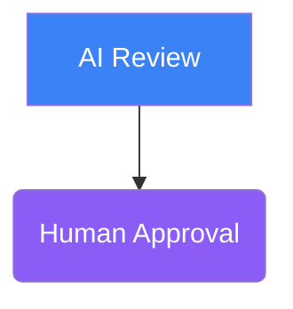
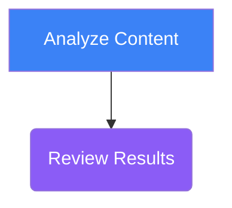
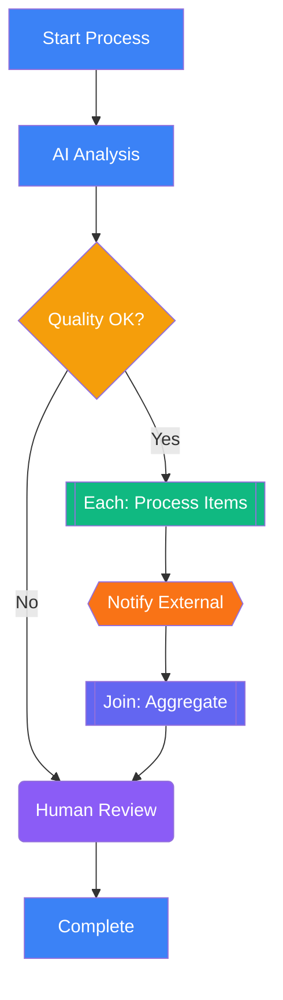
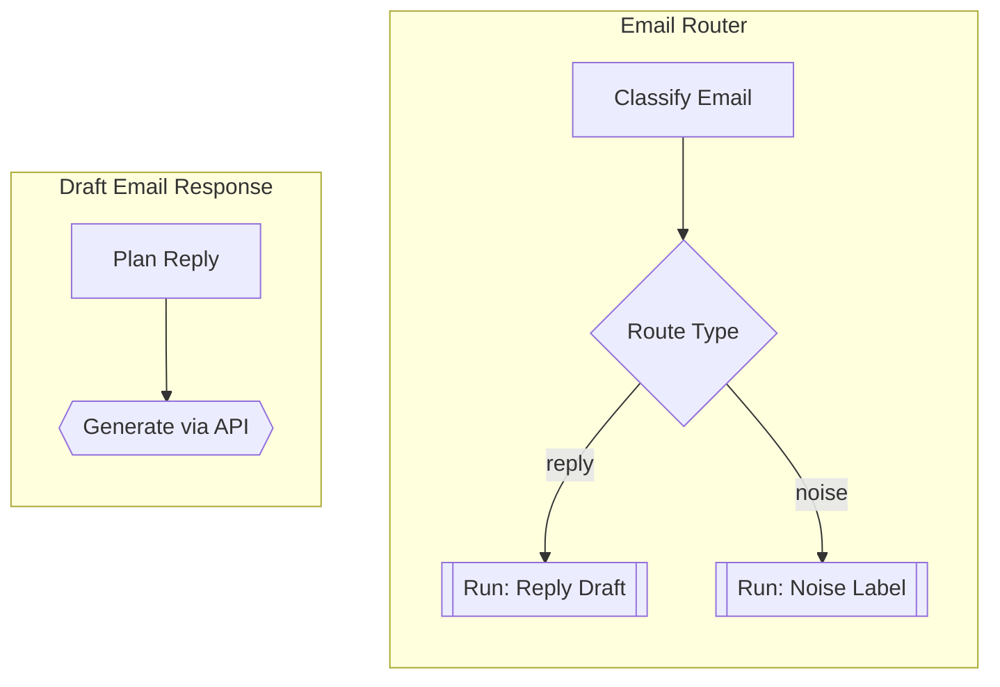

# AI Workflow Generation Guide

This document provides everything an AI needs to generate valid workflow import files for the Coordination Matrix system. Workflows can be defined in two formats: **Mermaid diagrams** or **JSON workflow definitions**.

## Quick Start

### Minimal JSON Workflow

```json
{
  "name": "Simple Review Workflow",
  "description": "AI reviews content, human approves",
  "steps": [
    {
      "id": "review",
      "name": "AI Review",
      "stepType": "agent",
      "additionalInstructions": "Review the submitted content for quality and accuracy."
    },
    {
      "id": "approve",
      "name": "Human Approval",
      "stepType": "manual"
    }
  ]
}
```

### Minimal Mermaid Workflow


```mermaid
flowchart TD
    review["AI Review"]
    approve("Human Approval")

    review --> approve

    classDef agent fill:#3B82F6,color:#fff
    classDef manual fill:#8B5CF6,color:#fff

    class review agent
    class approve manual
```

---

## Format Reference

### JSON Export Format (Complete)

When exporting a workflow, the system produces this structure:

```json
{
  "name": "Workflow Name",
  "description": "What this workflow does",
  "isActive": true,
  "rootTaskTitleTemplate": "{{input.projectName}} - Processing",
  "steps": [ /* WorkflowStep[] */ ],
  "mermaidDiagram": "flowchart TD\n    ...",
  "exportedAt": "2024-01-15T10:30:00.000Z",
  "version": "1.0"
}
```

### JSON Import Format (Minimal Required)

When importing, only `name` and `steps` are required:

```json
{
  "name": "Workflow Name",
  "steps": [
    {
      "id": "step1",
      "name": "Step Name",
      "stepType": "agent"
    }
  ]
}
```

---

## Step Types Reference

The system supports **11 distinct step types**. Each has a unique visual representation in Mermaid diagrams and specific execution modes.

### Step Type Quick Reference

| Step Type | Execution Mode | Mermaid Shape | Use Case |
|-----------|---------------|---------------|----------|
| `trigger` | immediate | `>"text"]` | Entry point / workflow start |
| `agent` | automated | `["text"]` | AI-powered tasks |
| `manual` | manual | `("text")` | Human-in-the-loop tasks |
| `external` | external_callback | `{{"text"}}` | External API with callback |
| `webhook` | automated | `{{"text"}}` | Outbound HTTP (no callback) |
| `decision` | immediate | `{"text"}` | Conditional routing |
| `foreach` | immediate | `[["Each: text"]]` | Fan-out iteration |
| `join` | immediate | `[["Join: text"]]` | Fan-in synchronization |
| `flow` | automated | `[["Run: text"]]` | Nested workflow |
| `code` | automated | `[/"text"/]` | JavaScript code execution |
| `findDocument` | automated | `[(text)]` | Semantic document search |

### 0. Trigger Step (`trigger`)

Entry point that fires once to begin workflow execution. Typically the first step.

| Property | Type | Required | Description |
|----------|------|----------|-------------|
| `id` | string | Yes | Unique identifier |
| `name` | string | Yes | Display name |
| `stepType` | `"trigger"` | Yes | Step type |

**Execution Mode:** immediate (runs instantly)
**Mermaid Shape:** Asymmetric `>"text"]`

```json
{
  "id": "start",
  "name": "Start Workflow",
  "stepType": "trigger"
}
```

```mermaid
start>"Start Workflow"]
class start trigger
```

---

### 1. Agent Step (`agent`)

AI-powered automated task executed by the daemon.

| Property | Type | Required | Description |
|----------|------|----------|-------------|
| `id` | string | Yes | Unique identifier |
| `name` | string | Yes | Display name |
| `stepType` | `"agent"` | Yes | Step type |
| `additionalInstructions` | string | No | Extra context/prompt for the AI |
| `defaultAssigneeId` | string | No | ID of the agent to execute this |

**Mermaid Shape:** Rectangle `["text"]`

```json
{
  "id": "analyze",
  "name": "Analyze Document",
  "stepType": "agent",
  "additionalInstructions": "Extract key themes and summarize in 3 bullet points.",
  "defaultAssigneeId": "code-reviewer"
}
```

```mermaid
analyze["Analyze Document"]
class analyze agent
```

---

### 2. Manual Step (`manual`)

Human-in-the-loop task that waits for user action via UI.

| Property | Type | Required | Description |
|----------|------|----------|-------------|
| `id` | string | Yes | Unique identifier |
| `name` | string | Yes | Display name |
| `stepType` | `"manual"` | Yes | Step type |
| `additionalInstructions` | string | No | Instructions shown to the user |
| `defaultAssigneeId` | string | No | User ID to assign this task |

**Mermaid Shape:** Round brackets `("text")`

```json
{
  "id": "approve",
  "name": "Manager Approval",
  "stepType": "manual",
  "additionalInstructions": "Review the analysis and approve or reject with feedback."
}
```

```mermaid
approve("Manager Approval")
class approve manual
```

---

### 3. External Step (`external`)

Calls an external API and waits for a callback response.

| Property | Type | Required | Description |
|----------|------|----------|-------------|
| `id` | string | Yes | Unique identifier |
| `name` | string | Yes | Display name |
| `stepType` | `"external"` | Yes | Step type |
| `externalConfig` | object | No | API call configuration |

**externalConfig properties:**

| Property | Type | Description |
|----------|------|-------------|
| `endpoint` | string | URL to call (supports `{{variable}}` templates) |
| `method` | string | HTTP method: GET, POST, PUT, PATCH, DELETE |
| `headers` | object | Key-value headers (supports templates) |
| `payloadTemplate` | string | JSON template for request body |
| `responseMapping` | object | Map response fields to output |

**Mermaid Shape:** Hexagon `{{"text"}}`

```json
{
  "id": "callApi",
  "name": "External Validation",
  "stepType": "external",
  "externalConfig": {
    "endpoint": "https://api.example.com/validate",
    "method": "POST",
    "headers": {
      "Authorization": "Bearer {{input.apiKey}}"
    },
    "payloadTemplate": "{\"data\": \"{{input.content}}\"}"
  }
}
```

```mermaid
callApi{{"External Validation"}}
class callApi external
```

---

### 4. Webhook Step (`webhook`)

Outbound HTTP call (fire-and-forget or await response, no callback required).

| Property | Type | Required | Description |
|----------|------|----------|-------------|
| `id` | string | Yes | Unique identifier |
| `name` | string | Yes | Display name |
| `stepType` | `"webhook"` | Yes | Step type |
| `webhookConfig` | object | No | Webhook configuration |

**webhookConfig properties:**

| Property | Type | Default | Description |
|----------|------|---------|-------------|
| `url` | string | - | URL to call (supports templates) |
| `method` | string | POST | HTTP method |
| `headers` | object | {} | Request headers |
| `bodyTemplate` | string | - | JSON body template |
| `maxRetries` | number | 3 | Maximum retry attempts |
| `timeoutMs` | number | 30000 | Request timeout in ms |
| `successStatusCodes` | number[] | [200-299] | HTTP codes considered success |

**Mermaid Shape:** Hexagon `{{"text"}}` (same as external)

```json
{
  "id": "notify",
  "name": "Send Notification",
  "stepType": "webhook",
  "webhookConfig": {
    "url": "https://hooks.slack.com/xxx",
    "method": "POST",
    "bodyTemplate": "{\"text\": \"Workflow {{input.workflowName}} completed!\"}"
  }
}
```

---

### 5. Decision Step (`decision`)

Routes workflow based on conditions evaluated against input data.

| Property | Type | Required | Description |
|----------|------|----------|-------------|
| `id` | string | Yes | Unique identifier |
| `name` | string | Yes | Display name (usually a question) |
| `stepType` | `"decision"` | Yes | Step type |
| `connections` | array | Yes | Conditional routing rules |
| `defaultConnection` | string | No | Target step ID when no conditions match |

**connections array item:**

| Property | Type | Description |
|----------|------|-------------|
| `targetStepId` | string | ID of the step to route to |
| `condition` | string | Condition expression (see below) |
| `label` | string | Display label for the connection |

**Condition Syntax:**
- `field:value` - Exact match
- `field:value1,value2` - Match any of values
- `field:>10` - Numeric comparison (>, <, >=, <=)

**Mermaid Shape:** Diamond `{"text"}`

```json
{
  "id": "checkPriority",
  "name": "Is Urgent?",
  "stepType": "decision",
  "connections": [
    { "targetStepId": "urgentPath", "condition": "priority:urgent", "label": "Yes" },
    { "targetStepId": "normalPath", "condition": "priority:normal", "label": "No" }
  ],
  "defaultConnection": "lowPriorityPath"
}
```

```mermaid
checkPriority{"Is Urgent?"}
checkPriority -->|"Yes"| urgentPath
checkPriority -->|"No"| normalPath
```

---

### 6. ForEach Step (`foreach`)

Fan-out: Creates parallel child tasks for each item in an array.

| Property | Type | Required | Description |
|----------|------|----------|-------------|
| `id` | string | Yes | Unique identifier |
| `name` | string | Yes | Display name |
| `stepType` | `"foreach"` | Yes | Step type |
| `itemsPath` | string | No* | JSONPath to array in input (e.g., `emails`) |
| `itemVariable` | string | No | Variable name for each item (default: `item`) |
| `maxItems` | number | No | Safety limit (default: 100) |
| `expectedCountPath` | string | No | JSONPath to get expected count |
| `connections` | array | Yes | Steps to execute for each item |

*Note: If `itemsPath` is omitted, the step waits for items via external callback.

**Mermaid Shape:** Double brackets `[["Each: text"]]`

```json
{
  "id": "processEmails",
  "name": "Process Each Email",
  "stepType": "foreach",
  "itemsPath": "recipients",
  "itemVariable": "recipient",
  "maxItems": 50,
  "connections": [
    { "targetStepId": "sendEmail" }
  ]
}
```

```mermaid
processEmails[["Each: Process Each Email"]]
```

**Child Task Input:**
Each child task receives:
- `{{item}}` or `{{recipient}}` - The current item
- `{{_index}}` - Zero-based index (0, 1, 2...)
- `{{_total}}` - Total number of items

---

### 7. Join Step (`join`)

Fan-in: Waits for all parallel tasks from a ForEach to complete.

| Property | Type | Required | Description |
|----------|------|----------|-------------|
| `id` | string | Yes | Unique identifier |
| `name` | string | Yes | Display name |
| `stepType` | `"join"` | Yes | Step type |
| `awaitStepId` | string | No | ID of ForEach step to wait for |
| `awaitTag` | string | No | Alternative: wait for tasks with this tag |
| `joinBoundary` | object | No | Completion boundary conditions |
| `minSuccessPercent` | number | No | Minimum % that must succeed (legacy) |
| `expectedCountPath` | string | No | JSONPath to get expected count |

**joinBoundary properties:**

| Property | Type | Description |
|----------|------|-------------|
| `minCount` | number | Minimum tasks that must complete |
| `minPercent` | number | Minimum percentage (default: 100) |
| `maxWaitMs` | number | Maximum time to wait |
| `failOnTimeout` | boolean | Fail or continue with partial results |

**Mermaid Shape:** Double brackets `[["Join: text"]]`

```json
{
  "id": "aggregateResults",
  "name": "Aggregate Results",
  "stepType": "join",
  "awaitStepId": "processEmails",
  "minSuccessPercent": 90
}
```

```mermaid
aggregateResults[["Join: Aggregate Results"]]
```

**Join Output:**
The join task aggregates child results:
- `aggregatedResults` - Array of all child task metadata
- `successCount` - Number of successful children
- `failedCount` - Number of failed children

---

### 8. Flow Step (`flow`)

Delegates execution to a nested/child workflow.

| Property | Type | Required | Description |
|----------|------|----------|-------------|
| `id` | string | Yes | Unique identifier |
| `name` | string | Yes | Display name |
| `stepType` | `"flow"` | Yes | Step type |
| `flowId` | string | No | ID of the workflow to run |
| `inputMapping` | object | No | Map input values to child workflow |

**Mermaid Shape:** Double brackets `[["Run: text"]]`

```json
{
  "id": "runSubworkflow",
  "name": "Run Validation",
  "stepType": "flow",
  "flowId": "674abc123...",
  "inputMapping": {
    "document": "{{input.content}}",
    "rules": "{{input.validationRules}}"
  }
}
```

```mermaid
runSubworkflow[["Run: Run Validation"]]
```

---

### 9. Code Step (`code`)

Execute JavaScript code in a sandboxed vm2 environment.

| Property | Type | Required | Description |
|----------|------|----------|-------------|
| `id` | string | Yes | Unique identifier |
| `name` | string | Yes | Display name |
| `stepType` | `"code"` | Yes | Step type |
| `codeConfig` | object | Yes | Code execution configuration |

**codeConfig properties:**

| Property | Type | Default | Description |
|----------|------|---------|-------------|
| `code` | string | - | JavaScript code to execute (receives `input` variable, must return a value) |
| `packages` | string[] | [] | Packages to inject into sandbox |
| `variables` | array | [] | Variable mappings: `{name, path}` to inject context values |
| `timeout` | number | 30000 | Max execution time in ms |
| `memoryLimit` | number | 128 | Memory limit in MB |
| `outputSchema` | object | - | JSON Schema to validate output |
| `continueOnError` | boolean | false | Complete with error in output instead of failing |

**Available Sandbox Packages (35+):**
- **HTTP:** node-fetch (as `fetch`), axios, qs
- **Data:** lodash (as `_`), ramda (as `R`), immer, deepmerge
- **Strings:** validator, slugify, change-case, marked, sanitize-html
- **Numbers:** bignumber.js (as `BigNumber`), decimal.js (as `Decimal`), mathjs (as `math`), currency.js
- **Dates:** date-fns (as `dateFns`), dayjs, luxon, ms
- **JSON/Data:** jsonpath-plus (as `JSONPath`), json5, yaml, csv-parse, csv-stringify, papaparse (as `Papa`), fast-xml-parser (as `XMLParser`)
- **Validation:** zod (as `z`), yup, ajv (as `Ajv`)
- **IDs:** uuid, nanoid, ulid, hashids (as `Hashids`)
- **Crypto:** crypto-js (as `CryptoJS`), bcryptjs (as `bcrypt`), jsonwebtoken (as `jwt`), js-base64 (as `Base64`)
- **Async:** p-limit, p-map, p-retry, delay
- **Templating:** handlebars, mustache, ejs
- **Other:** fast-json-patch (as `jsonPatch`), diff (as `Diff`), pako, lz-string, @faker-js/faker (as `faker`)

**Mermaid Shape:** Parallelogram `[/"text"/]`

```json
{
  "id": "transform",
  "name": "Transform Data",
  "stepType": "code",
  "codeConfig": {
    "code": "const results = input.items.map(i => ({ name: i.name.toUpperCase(), id: i.id })); return { processed: results, count: results.length };",
    "packages": ["lodash"],
    "timeout": 30000
  }
}
```

**Advanced example with variable injection:**
```json
{
  "id": "fetchAndProcess",
  "name": "Fetch and Process",
  "stepType": "code",
  "codeConfig": {
    "code": "const response = await fetch(apiUrl + '/data/' + input.id); const data = await response.json(); return { data, timestamp: new Date().toISOString() };",
    "packages": ["node-fetch"],
    "variables": [
      { "name": "apiUrl", "path": "trigger._API_URL" }
    ],
    "timeout": 60000,
    "continueOnError": true
  }
}
```

```mermaid
transform[/"Transform Data"/]
class transform code
```

---

### 10. FindDocument Step (`findDocument`)

Search for documents using semantic search or fetch by specific ID.

| Property | Type | Required | Description |
|----------|------|----------|-------------|
| `id` | string | Yes | Unique identifier |
| `name` | string | Yes | Display name |
| `stepType` | `"findDocument"` | Yes | Step type |
| `findDocumentConfig` | object | Yes | Document search configuration |

**findDocumentConfig properties:**

| Property | Type | Default | Description |
|----------|------|---------|-------------|
| `mode` | `"static"` \| `"dynamic"` | "dynamic" | Static fetches by ID, dynamic searches |
| `documentId` | string | - | Specific document ID (for static mode) |
| `searchPrompt` | string | - | Search query template (for dynamic mode, supports `{{variable}}`) |
| `documentTypes` | string[] | - | Filter by document type (e.g., "workflow-prompt", "reference") |
| `documentStatus` | string[] | - | Filter by status |
| `tags` | string[] | - | Filter by tags |
| `limit` | number | 1 | Max results to return |
| `minScore` | number | 0.5 | Minimum similarity threshold (0-1) |
| `storeAs` | string | - | Variable name to store result |
| `failIfNotFound` | boolean | false | Fail step if no documents found |

**Mermaid Shape:** Cylinder `[(text)]`

```json
{
  "id": "findContext",
  "name": "Find Related Documents",
  "stepType": "findDocument",
  "findDocumentConfig": {
    "mode": "dynamic",
    "searchPrompt": "Find documentation about {{input.topic}}",
    "documentTypes": ["workflow-prompt", "reference"],
    "limit": 3,
    "minScore": 0.5,
    "storeAs": "contextDocs"
  }
}
```

**Static mode example (fetch specific document):**
```json
{
  "id": "getTemplate",
  "name": "Get Email Template",
  "stepType": "findDocument",
  "findDocumentConfig": {
    "mode": "static",
    "documentId": "doc_12345",
    "failIfNotFound": true
  }
}
```

```mermaid
findContext[("Find Related Documents")]
class findContext findDocument
```

**Output:**
- `documents`: Array of found documents with id, title, type, score
- The document content is available for subsequent steps

---

## Template Variables

The system supports variable interpolation using `{{variable}}` syntax in:
- `additionalInstructions`
- `rootTaskTitleTemplate`
- External/webhook URLs and payloads
- Input mappings
- Code step variable injection
- FindDocument searchPrompt

### Available Variables

| Variable | Context | Description |
|----------|---------|-------------|
| `{{input.path}}` | All steps | Access input payload by path |
| `{{fieldName}}` | All steps | Direct lookup (shorthand for `{{input.fieldName}}`) |
| `{{trigger.payload.path}}` | All steps | Access original trigger payload from any step |
| `{{item}}` or `{{_item}}` | ForEach children | Current item being processed |
| `{{customVar}}` | ForEach children | Custom item variable (if `itemVariable` is set) |
| `{{_index}}` | ForEach children | Zero-based index of current item |
| `{{_total}}` | ForEach children | Total number of items |
| `{{variables.name}}` | All steps | Access stored variable packages |
| `{{variables.name.path}}` | All steps | Nested path in variable package |
| `{{variables.name[key].path}}` | All steps | Dynamic key access with bracket notation |
| `{{callbackUrl}}` | External steps | System-generated callback URL |
| `{{callbackSecret}}` | External steps | Secret for callback authentication |
| `{{systemWebhookUrl}}` | External steps | Smart callback URL (routes to foreach if available) |
| `{{foreachWebhookUrl}}` | External with ForEach | URL for streaming items to ForEach |
| `{{workflowRunId}}` | All steps | Current workflow run ID |
| `{{stepId}}` | All steps | Current step ID |
| `{{taskId}}` | All steps | Current task ID |
| `{{_apiUrl}}` | All steps | Base API URL |
| `{{_apiKey}}` | All steps | API key for callbacks |

### Nested Interpolation

Variables support nested interpolation for dynamic key access:

```
{{variables.config[{{input.environment}}].database.host}}
```

This first resolves `{{input.environment}}` (e.g., "production"), then accesses `variables.config.production.database.host`.

### Path Syntax

Use dot notation to access nested values:

```json
{
  "inputPayload": {
    "user": {
      "name": "John",
      "emails": ["john@example.com"]
    }
  }
}
```

- `{{input.user.name}}` → `"John"`
- `{{input.user.emails.0}}` → `"john@example.com"`

---

## Connections and Flow Control

### Linear Flow (Default)

If a step has no `connections` array, workflow proceeds linearly to the next step in the array:

```json
{
  "steps": [
    { "id": "step1", "name": "First", "stepType": "agent" },
    { "id": "step2", "name": "Second", "stepType": "manual" },
    { "id": "step3", "name": "Third", "stepType": "agent" }
  ]
}
```

Flow: step1 → step2 → step3

### Explicit Connections

Use `connections` array for non-linear flows:

```json
{
  "id": "step1",
  "name": "First",
  "stepType": "agent",
  "connections": [
    { "targetStepId": "step3" }
  ]
}
```

Flow: step1 → step3 (skips step2)

### Conditional Branching (Decision)

Decision steps require connections with conditions:

```json
{
  "id": "decide",
  "stepType": "decision",
  "connections": [
    { "targetStepId": "pathA", "condition": "status:approved", "label": "Approved" },
    { "targetStepId": "pathB", "condition": "status:rejected", "label": "Rejected" }
  ],
  "defaultConnection": "pathC"
}
```

---

## Mermaid Syntax Guide

### Differences from Standard Mermaid

The Coordination Matrix workflow system uses standard Mermaid `flowchart TD` syntax with these **important conventions**:

| Feature | Standard Mermaid | Coordination Matrix |
|---------|------------------|---------------------|
| Node shapes | Any shape | Shape = step type (semantic) |
| Inline styles | `style nodeId fill:#...` | **NOT ALLOWED** |
| Styling | Optional | Required via `classDef` + `class` |
| Labels | Unquoted ok | **Always quote with `""`** |
| Node IDs | Any format | Prefer stable IDs for round-trip |
| Comments | `%%` | `%% @step(id): {json}` for metadata |

### Required Class Definitions

Always include all class definitions at the end of the diagram:

```mermaid
classDef trigger fill:#6B7280,color:#fff
classDef agent fill:#3B82F6,color:#fff
classDef manual fill:#8B5CF6,color:#fff
classDef external fill:#F97316,color:#fff
classDef decision fill:#F59E0B,color:#fff
classDef foreach fill:#10B981,color:#fff
classDef join fill:#6366F1,color:#fff
classDef flow fill:#EC4899,color:#fff
classDef code fill:#0EA5E9,color:#fff
classDef findDocument fill:#14B8A6,color:#fff
```

### Shape-to-Type Mapping

| Mermaid Shape | Syntax | Step Type | Color |
|---------------|--------|-----------|-------|
| Asymmetric | `>"text"]` | trigger | Gray #6B7280 |
| Rectangle | `["text"]` | agent | Blue #3B82F6 |
| Round/Stadium | `("text")` | manual | Purple #8B5CF6 |
| Hexagon | `{{"text"}}` | external | Orange #F97316 |
| Hexagon | `{{"text"}}` | webhook | Orange #F97316 |
| Diamond | `{"text"}` | decision | Amber #F59E0B |
| Subroutine | `[["Each: text"]]` | foreach | Green #10B981 |
| Subroutine | `[["Join: text"]]` | join | Indigo #6366F1 |
| Subroutine | `[["Run: text"]]` | flow | Pink #EC4899 |
| Parallelogram | `[/"text"/]` | code | Cyan #0EA5E9 |
| Cylinder | `[(text)]` | findDocument | Teal #14B8A6 |

### Preserving Configuration in Mermaid

Step configuration is stored in special comments:


```mermaid
flowchart TD
    step1["Analyze Content"]
    step2("Review Results")

    step1 --> step2

    classDef agent fill:#3B82F6,color:#fff
    classDef manual fill:#8B5CF6,color:#fff

    class step1 agent
    class step2 manual

    %% Step configuration (preserved on import)
    %% @step(step1): {"additionalInstructions":"Extract key themes and entities."}
    %% @step(step2): {"defaultAssigneeId":"user123"}
```

### Complete Mermaid Example


```mermaid
flowchart TD
    trigger["Start Process"]
    analyze["AI Analysis"]
    checkResult{"Quality OK?"}
    processItems[["Each: Process Items"]]
    sendNotif{{"Notify External"}}
    aggregate[["Join: Aggregate"]]
    review("Human Review")
    complete["Complete"]

    trigger --> analyze
    analyze --> checkResult
    checkResult -->|"Yes"| processItems
    checkResult -->|"No"| review
    processItems --> sendNotif
    sendNotif --> aggregate
    aggregate --> review
    review --> complete

    classDef agent fill:#3B82F6,color:#fff
    classDef manual fill:#8B5CF6,color:#fff
    classDef external fill:#F97316,color:#fff
    classDef decision fill:#F59E0B,color:#fff
    classDef foreach fill:#10B981,color:#fff
    classDef join fill:#6366F1,color:#fff

    class trigger,analyze,complete agent
    class review manual
    class checkResult decision
    class processItems foreach
    class sendNotif external
    class aggregate join

    %% @step(analyze): {"additionalInstructions":"Analyze for quality issues."}
    %% @step(processItems): {"itemsPath":"items","itemVariable":"item"}
    %% @step(aggregate): {"awaitStepId":"processItems","minSuccessPercent":90}
```

---

## Common Workflow Patterns

### 1. Linear Review Pipeline

```json
{
  "name": "Content Review Pipeline",
  "steps": [
    { "id": "draft", "name": "AI Draft", "stepType": "agent",
      "additionalInstructions": "Draft initial content based on the brief." },
    { "id": "review", "name": "Editor Review", "stepType": "manual",
      "additionalInstructions": "Review and provide feedback." },
    { "id": "revise", "name": "AI Revision", "stepType": "agent",
      "additionalInstructions": "Apply editor feedback and revise." },
    { "id": "approve", "name": "Final Approval", "stepType": "manual" }
  ]
}
```

### 2. Parallel Processing (Fan-out/Fan-in)

```json
{
  "name": "Batch Email Campaign",
  "steps": [
    { "id": "prepare", "name": "Prepare Campaign", "stepType": "agent" },
    { "id": "foreach", "name": "Process Recipients", "stepType": "foreach",
      "itemsPath": "recipients", "itemVariable": "recipient",
      "connections": [{ "targetStepId": "send" }] },
    { "id": "send", "name": "Send Email", "stepType": "external" },
    { "id": "join", "name": "Aggregate Results", "stepType": "join",
      "awaitStepId": "foreach" },
    { "id": "report", "name": "Generate Report", "stepType": "agent" }
  ]
}
```

### 3. Conditional Routing

```json
{
  "name": "Ticket Triage",
  "steps": [
    { "id": "analyze", "name": "Analyze Ticket", "stepType": "agent" },
    { "id": "route", "name": "Route by Severity", "stepType": "decision",
      "connections": [
        { "targetStepId": "urgent", "condition": "severity:critical,high", "label": "Urgent" },
        { "targetStepId": "normal", "condition": "severity:medium", "label": "Normal" }
      ],
      "defaultConnection": "lowPriority" },
    { "id": "urgent", "name": "Escalate to On-Call", "stepType": "external" },
    { "id": "normal", "name": "Standard Processing", "stepType": "agent" },
    { "id": "lowPriority", "name": "Queue for Later", "stepType": "manual" }
  ]
}
```

### 4. External Service Integration

```json
{
  "name": "Document Processing",
  "steps": [
    { "id": "upload", "name": "Upload to S3", "stepType": "webhook",
      "webhookConfig": {
        "url": "https://api.storage.example.com/upload",
        "method": "POST",
        "bodyTemplate": "{\"content\": \"{{input.document}}\", \"callback\": \"{{callbackUrl}}\"}"
      }
    },
    { "id": "process", "name": "OCR Processing", "stepType": "external",
      "externalConfig": {
        "endpoint": "https://ocr.example.com/process",
        "method": "POST",
        "payloadTemplate": "{\"url\": \"{{input.uploadUrl}}\", \"webhook\": \"{{callbackUrl}}\"}"
      }
    },
    { "id": "analyze", "name": "Analyze Results", "stepType": "agent" }
  ]
}
```

---

## Validation Rules

### Required Fields

1. Every step must have: `id`, `name`, `stepType`
2. `stepType` must be one of: `agent`, `manual`, `external`, `webhook`, `decision`, `foreach`, `join`, `flow`
3. Decision steps must have `connections` array with at least one entry
4. ForEach steps should have either `itemsPath` or expect external callback

### Best Practices

1. **Use descriptive step IDs**: `analyzeDocument` instead of `step1`
2. **Keep additionalInstructions concise**: Focus on what makes this step unique
3. **Set realistic maxItems**: Prevent runaway fan-out
4. **Always specify awaitStepId for Join**: Don't rely on implicit matching
5. **Quote all Mermaid labels**: Prevents parsing issues with special characters

### Common Errors

| Error | Cause | Fix |
|-------|-------|-----|
| "Invalid step type" | Typo in stepType | Use exact values: `agent`, `manual`, etc. |
| "Step ID not found" | Connection to non-existent step | Check targetStepId matches a step id |
| "Circular dependency" | A → B → C → A | Redesign to be acyclic |
| "Join without ForEach" | awaitStepId doesn't match | Ensure awaitStepId points to a foreach step |

---

## Multi-Workflow Import Format

For importing multiple workflows in a single file, use subgraphs with metadata comments:

### Metadata Comments

Place these **before** each subgraph:

| Annotation | Required | Description |
|------------|----------|-------------|
| `%% @workflow: "Name"` | Yes | Workflow name |
| `%% @description: text` | No | Workflow description |
| `%% @isActive: true/false` | No | Whether workflow is active (default: true) |
| `%% @rootTaskTitleTemplate: text` | No | Template for root task titles |
| `%% @id: workflowId` | No | Existing ID to update (omit for new) |

### Multi-Workflow Example


```mermaid
flowchart TD

    %% @workflow: "Email Router"
    %% @description: Routes inbound emails to appropriate handlers
    %% @isActive: true
    %% @rootTaskTitleTemplate: Email Router - {{input.email.subject}}

    subgraph emailRouter["Email Router"]
        direction TB

        classify["Classify Email"]
        route{"Route Type"}
        replyFlow[["Run: Reply Draft"]]
        noiseFlow[["Run: Noise Label"]]

        classify --> route
        route -->|"reply"| replyFlow
        route -->|"noise"| noiseFlow

        %% @step(classify): {"defaultAssigneeId":"agent123","additionalInstructions":"Classify email into: reply, info, action, noise."}
        %% @step(route): {"defaultConnection":"noiseFlow"}
        %% @step(replyFlow): {"flowId":"draftEmailResponse","inputMapping":{"email":"{{input.email}}"}}
        %% @step(noiseFlow): {"flowId":"labelNoise"}
    end

    %% @workflow: "Draft Email Response"
    %% @description: Generates draft replies

    subgraph draftEmailResponse["Draft Email Response"]
        direction TB

        plan["Plan Reply"]
        draft{{"Generate via API"}}

        plan --> draft

        %% @step(plan): {"additionalInstructions":"Create reply outline."}
        %% @step(draft): {"externalConfig":{"endpoint":"{{input.api.url}}","method":"POST"}}
    end

    %% Styling (required at end)
    classDef agent fill:#3B82F6,color:#fff
    classDef decision fill:#F59E0B,color:#fff
    classDef external fill:#F97316,color:#fff
    classDef flow fill:#EC4899,color:#fff
```

### Important Notes for @step JSON

1. **JSON must be valid**: The parser will skip steps with invalid JSON and report warnings
2. **Use escaped quotes correctly**: Inside `bodyTemplate` or `payloadTemplate`, use `\"` for quotes in the nested JSON string
3. **Templates containing JSON**: For complex templates, consider using single quotes or proper escaping:

**Correct:**
```
%% @step(notify): {"webhookConfig":{"bodyTemplate":"{\"status\": \"{{status}}\"}"}}
```

**Incorrect (double-escaped):**
```
%% @step(notify): {"webhookConfig":{"bodyTemplate":"{\\"status\\": \\"{{status}}\\"}"}}
```

### Step Type from CSS Class

The parser infers step type from the `:::class` suffix:

```mermaid
analyze["Analyze Data"]:::agent      %% stepType: agent
review("Human Review"):::manual       %% stepType: manual
callApi{{"External API"}}:::external  %% stepType: external
route{"Decision"}:::decision          %% stepType: decision
process[["Each: Item"]]:::foreach     %% stepType: foreach
merge[["Join: Results"]]:::join       %% stepType: join
runSub[["Run: Subprocess"]]:::flow    %% stepType: flow
```

### API Endpoint

```http
POST /api/workflows/import-multi
Content-Type: application/json

{
  "mermaid": "flowchart TD\n\n    %% @workflow: \"Name\"...",
  "dryRun": true
}
```

**Response:**
```json
{
  "data": {
    "results": [
      {
        "name": "Email Router",
        "id": "674abc...",
        "action": "create",
        "stepCount": 4,
        "warnings": ["Invalid JSON in @step(xyz): Unexpected token..."]
      }
    ],
    "summary": { "total": 2, "created": 2, "updated": 0, "skipped": 0 },
    "dryRun": true
  }
}
```

Use `dryRun: true` to validate before importing.

---

## API Endpoints

### Parse Mermaid to Steps

```http
POST /api/workflows/parse-mermaid
Content-Type: application/json

{
  "mermaidDiagram": "flowchart TD\n    step1[\"Review\"]..."
}
```

**Response:**
```json
{
  "data": {
    "steps": [/* WorkflowStep[] */],
    "mermaidDiagram": "..."
  }
}
```

### Generate Mermaid from Steps

```http
POST /api/workflows/generate-mermaid
Content-Type: application/json

{
  "steps": [/* WorkflowStep[] */],
  "name": "Workflow Name"
}
```

**Response:**
```json
{
  "data": {
    "mermaidDiagram": "flowchart TD\n..."
  }
}
```

### Create Workflow

```http
POST /api/workflows
Content-Type: application/json

{
  "name": "My Workflow",
  "description": "...",
  "steps": [/* WorkflowStep[] */],
  "mermaidDiagram": "flowchart TD\n..."
}
```

---

## Appendix: Full WorkflowStep Schema

```typescript
interface WorkflowStep {
  // Required
  id: string;
  name: string;
  stepType: 'trigger' | 'agent' | 'manual' | 'external' | 'webhook' | 'decision' | 'foreach' | 'join' | 'flow' | 'code' | 'findDocument';

  // Optional - Common
  description?: string;
  connections?: StepConnection[];

  // Optional - Agent/Manual
  additionalInstructions?: string;
  defaultAssigneeId?: string;
  promptDocumentIds?: string[];  // IDs of workflow-prompt documents to prepend

  // Optional - Input Configuration (unified model for all step types)
  inputConfig?: {
    source: 'previous' | 'trigger' | string;  // Where to get input
    mapping?: Record<string, string>;          // Field mapping with templates
    extractPath?: string;                      // Simple path extraction
  };

  // Optional - External
  externalConfig?: {
    endpoint?: string;
    method?: 'GET' | 'POST' | 'PUT' | 'PATCH' | 'DELETE';
    headers?: Record<string, string>;
    payloadTemplate?: string;
    responseMapping?: Record<string, string>;
    waitForCallback?: boolean;       // true to wait, false for fire-and-forget
    successStatusCodes?: number[];
  };

  // Optional - Webhook
  webhookConfig?: {
    url?: string;
    method?: 'GET' | 'POST' | 'PUT' | 'PATCH' | 'DELETE';
    headers?: Record<string, string>;
    bodyTemplate?: string;
    maxRetries?: number;
    timeoutMs?: number;
    successStatusCodes?: number[];
  };

  // Optional - Decision
  defaultConnection?: string;

  // Optional - ForEach
  itemsPath?: string;
  itemVariable?: string;
  maxItems?: number;
  expectedCountPath?: string;

  // Optional - Join
  awaitStepId?: string;
  awaitTag?: string;
  joinBoundary?: {
    minCount?: number;
    minPercent?: number;
    maxWaitMs?: number;
    failOnTimeout?: boolean;
  };
  minSuccessPercent?: number;

  // Optional - Flow
  flowId?: string;
  inputMapping?: Record<string, string>;

  // Optional - Code
  codeConfig?: {
    code: string;                              // JavaScript code to execute
    packages?: string[];                       // Packages to inject into sandbox
    variables?: Array<{name: string; path: string}>;  // Variable mappings
    timeout?: number;                          // Max execution time in ms (default: 30000)
    memoryLimit?: number;                      // Memory limit in MB (default: 128)
    outputSchema?: object;                     // JSON Schema for output validation
    continueOnError?: boolean;                 // Complete with error instead of failing
  };

  // Optional - FindDocument
  findDocumentConfig?: {
    mode?: 'static' | 'dynamic';               // Static fetches by ID, dynamic searches
    documentId?: string;                       // Specific document ID (static mode)
    searchPrompt?: string;                     // Search query template (dynamic mode)
    documentTypes?: string[];                  // Filter by document type
    documentStatus?: string[];                 // Filter by status
    tags?: string[];                           // Filter by tags
    limit?: number;                            // Max results (default: 1)
    minScore?: number;                         // Minimum similarity threshold
    storeAs?: string;                          // Variable name for result
    failIfNotFound?: boolean;                  // Fail step if no documents found
  };

  // Optional - Input Control
  inputSource?: string;
  inputPath?: string;
}

interface StepConnection {
  targetStepId: string;
  condition?: string | null;
  label?: string;
}
```

---

*Generated for Coordination Matrix v1.0*
