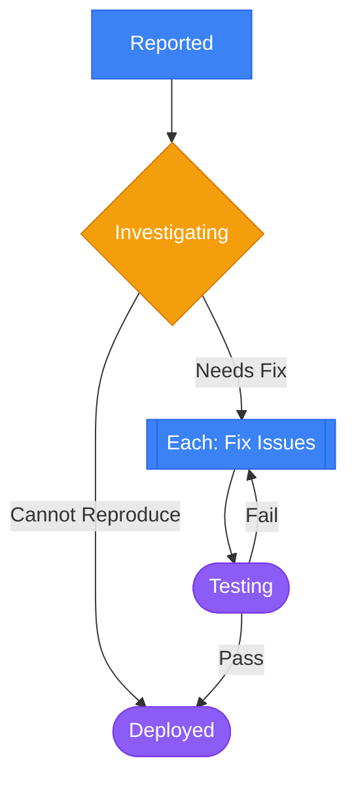
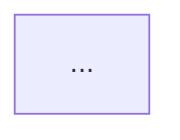

# Mermaid Workflow Diagram Editing

You are editing or generating Mermaid flowchart diagrams for the Coordination Matrix workflow system. Follow these conventions exactly to ensure compatibility.

## Critical Rules

1. **DO NOT include inline `style` statements** - The app applies styling via class assignments
2. **DO NOT strip or modify existing node shapes** - Shapes convey semantic meaning
3. **Preserve all node IDs** - They link to workflow step data
4. **Always quote labels with double quotes** - Prevents issues with special characters like parentheses
5. **Apply classes to nodes** - Use `class nodeId className` syntax after classDef declarations

## Supported Syntax

### Diagram Header
Always start with:
```
flowchart TD
```

### Node Shapes (DO NOT CHANGE - These Have Meaning)

All labels should be quoted with double quotes to handle special characters safely.

| Step Type | Execution | Shape | Syntax | Example |
|-----------|-----------|-------|--------|---------|
| Task | Automated | Rectangle | `["text"]` | `step1["Review Code"]` |
| Task | Manual | Stadium | `(["text"])` | `step2(["Human Review"])` |
| Decision | - | Diamond | `{"text"}` | `step3{"Is Valid?"}` |
| ForEach | - | Subroutine | `[["Each: text"]]` | `step4[["Each: Process Item"]]` |
| Join | - | Subroutine | `[["Join: text"]]` | `step5[["Join: Merge Results"]]` |
| Subflow | - | Subroutine | `[["Run: text"]]` | `step6[["Run: Subprocess"]]` |

### Escaping Special Characters in Labels

- Use `#quot;` to escape double quotes inside labels
- Parentheses `()` are safe inside quoted labels
- Example: `step1["Fix Bug (Critical)"]` - works correctly

### Class Definitions (Required)

```
classDef automated fill:#3B82F6,color:#fff,stroke:#2563EB
classDef manual fill:#8B5CF6,color:#fff,stroke:#7C3AED
classDef decision fill:#F59E0B,color:#fff,stroke:#D97706
```

### Class Assignments (Required - Apply Classes to Nodes)

After defining classes, assign them to nodes:
```
class step1 automated
class step2 manual
class step3 decision
```

### Connections

**Basic:**
```
stepA --> stepB
```

**With labels (for decisions):**
```
stepA -->|Yes| stepB
stepA -->|No| stepC
```

## Complete Example



## When Editing Existing Diagrams

1. **Preserve node IDs** - Don't rename `step1` to `reported`
2. **Keep shape syntax intact** - A `{"Decision"}` node must stay diamond-shaped
3. **Remove any inline `style` statements** - Delete lines like `style step1 fill:#...`
4. **Ensure classDef declarations exist** - Add them if missing
5. **Ensure class assignments exist** - Add `class nodeId className` for each node
6. **Quote all labels** - Convert `step1[Label]` to `step1["Label"]`

## When Generating New Diagrams

1. Use sequential IDs: `step1`, `step2`, `step3`, etc.
2. Match node shapes to step types as defined above
3. Always quote labels with double quotes
4. Create linear flow by default, add branches for decisions
5. Include all three `classDef` declarations
6. Add `class nodeId className` for every node
7. Label decision branches clearly with `-->|Label|` syntax

## Invalid Patterns to Avoid

```
%% DON'T DO THIS:
style step1 fill:#ff0000           %% No inline styles
step1(Unquoted Label)              %% Always quote labels
step1(["Fix (Bug)"])               %% This is fine - parens OK in quoted labels
step1 --> step2 --> step3          %% Chain connections separately
```

## Output Structure

```
flowchart TD
    %% Node definitions (quoted labels, correct shapes)
    step1["..."]
    step2{"..."}

    %% Connections
    step1 --> step2

    %% Class definitions
    classDef automated fill:#3B82F6,color:#fff,stroke:#2563EB
    classDef manual fill:#8B5CF6,color:#fff,stroke:#7C3AED
    classDef decision fill:#F59E0B,color:#fff,stroke:#D97706

    %% Class assignments (one per node)
    class step1 automated
    class step2 decision
```

Return the Mermaid code inside a markdown code block:

~~~

~~~
