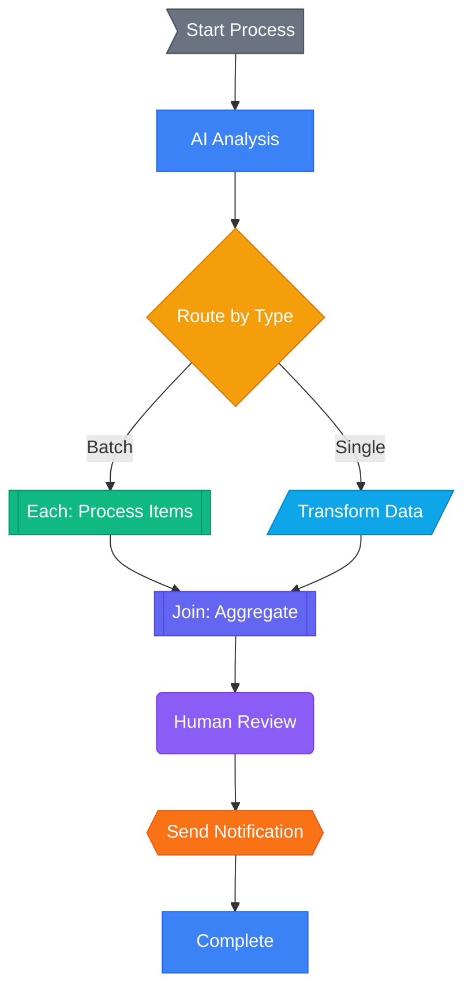
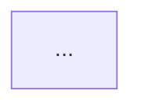

# Mermaid Workflow Diagram Editing

You are editing or generating Mermaid flowchart diagrams for the Coordination Matrix workflow system. Follow these conventions exactly to ensure compatibility.

> **For AI Tools:** See the comprehensive [AI Workflow Generation Guide](./ai-workflow-generation.md) for complete documentation including JSON format, template variables, and step type configuration.
>
> **Dynamic Context API:** Use `GET /api/workflows/ai-prompt-context` to fetch available agents, users, and workflows for your prompts.

## Critical Rules

1. **DO NOT include inline `style` statements** - The app applies styling via class assignments
2. **DO NOT strip or modify existing node shapes** - Shapes convey semantic meaning
3. **Preserve all node IDs** - They link to workflow step data
4. **Always quote labels with double quotes** - Prevents issues with special characters like parentheses
5. **Apply classes to nodes** - Use `class nodeId className` syntax after classDef declarations

## Supported Syntax

### Diagram Header
Always start with:
```
flowchart TD
```

### Node Shapes (DO NOT CHANGE - These Have Meaning)

All labels should be quoted with double quotes to handle special characters safely.

| Step Type | Shape | Syntax | Example |
|-----------|-------|--------|---------|
| Trigger (Entry) | Asymmetric | `>"text"]` | `start>"Start Workflow"]` |
| Agent (AI) | Rectangle | `["text"]` | `step1["Review Code"]` |
| Manual (Human) | Stadium | `("text")` | `step2("Human Review")` |
| External (API + callback) | Hexagon | `{{"text"}}` | `step3{{"API Call"}}` |
| Webhook (Fire-and-forget) | Hexagon | `{{"text"}}` | `step3{{"Notify"}}` |
| Decision | Diamond | `{"text"}` | `step4{"Is Valid?"}` |
| ForEach | Subroutine | `[["Each: text"]]` | `step5[["Each: Process Item"]]` |
| Join | Subroutine | `[["Join: text"]]` | `step6[["Join: Merge Results"]]` |
| Flow | Subroutine | `[["Run: text"]]` | `step7[["Run: Subprocess"]]` |
| Code (JavaScript) | Parallelogram | `[/"text"/]` | `step8[/"Transform Data"/]` |
| FindDocument | Cylinder | `[(text)]` | `step9[("Find Docs")]` |

### Escaping Special Characters in Labels

- Use `#quot;` to escape double quotes inside labels
- Parentheses `()` are safe inside quoted labels
- Example: `step1["Fix Bug (Critical)"]` - works correctly

### Class Definitions (Required)

```
classDef trigger fill:#6B7280,color:#fff,stroke:#4B5563
classDef agent fill:#3B82F6,color:#fff,stroke:#2563EB
classDef manual fill:#8B5CF6,color:#fff,stroke:#7C3AED
classDef external fill:#F97316,color:#fff,stroke:#EA580C
classDef decision fill:#F59E0B,color:#fff,stroke:#D97706
classDef foreach fill:#10B981,color:#fff,stroke:#059669
classDef join fill:#6366F1,color:#fff,stroke:#4F46E5
classDef flow fill:#EC4899,color:#fff,stroke:#DB2777
classDef code fill:#0EA5E9,color:#fff,stroke:#0284C7
classDef findDocument fill:#14B8A6,color:#fff,stroke:#0D9488
```

### Class Assignments (Required - Apply Classes to Nodes)

After defining classes, assign them to nodes:
```
class step1 agent
class step2 manual
class step3 external
class step4 decision
```

### Connections

**Basic:**
```
stepA --> stepB
```

**With labels (for decisions):**
```
stepA -->|Yes| stepB
stepA -->|No| stepC
```

## Complete Example


```mermaid
flowchart TD
    start>"Start Process"]
    step1["AI Analysis"]
    step2{"Route by Type"}
    step3[["Each: Process Items"]]
    step4[/"Transform Data"/]
    step5[["Join: Aggregate"]]
    step6("Human Review")
    step7{{"Send Notification"}}
    step8["Complete"]

    start --> step1
    step1 --> step2
    step2 -->|"Batch"| step3
    step2 -->|"Single"| step4
    step3 --> step5
    step4 --> step5
    step5 --> step6
    step6 --> step7
    step7 --> step8

    classDef trigger fill:#6B7280,color:#fff,stroke:#4B5563
    classDef agent fill:#3B82F6,color:#fff,stroke:#2563EB
    classDef manual fill:#8B5CF6,color:#fff,stroke:#7C3AED
    classDef external fill:#F97316,color:#fff,stroke:#EA580C
    classDef decision fill:#F59E0B,color:#fff,stroke:#D97706
    classDef foreach fill:#10B981,color:#fff,stroke:#059669
    classDef join fill:#6366F1,color:#fff,stroke:#4F46E5
    classDef flow fill:#EC4899,color:#fff,stroke:#DB2777
    classDef code fill:#0EA5E9,color:#fff,stroke:#0284C7
    classDef findDocument fill:#14B8A6,color:#fff,stroke:#0D9488

    class start trigger
    class step1,step8 agent
    class step2 decision
    class step3 foreach
    class step4 code
    class step5 join
    class step6 manual
    class step7 external

    %% Step configuration (preserved on import)
    %% @step(step1): {"additionalInstructions":"Analyze the input and determine processing type"}
    %% @step(step3): {"itemsPath":"items","itemVariable":"item","maxItems":100}
    %% @step(step4): {"codeConfig":{"code":"return { processed: input.items.map(i => i.value * 2) };","packages":["lodash"]}}
    %% @step(step5): {"awaitStepId":"step3","joinBoundary":{"minPercent":90}}
```

## When Editing Existing Diagrams

1. **Preserve node IDs** - Don't rename `step1` to `reported`
2. **Keep shape syntax intact** - A `{"Decision"}` node must stay diamond-shaped
3. **Remove any inline `style` statements** - Delete lines like `style step1 fill:#...`
4. **Ensure classDef declarations exist** - Add them if missing
5. **Ensure class assignments exist** - Add `class nodeId className` for each node
6. **Quote all labels** - Convert `step1[Label]` to `step1["Label"]`

## When Generating New Diagrams

1. Use sequential IDs: `step1`, `step2`, `step3`, etc. (or semantic names like `analyze`, `review`)
2. Match node shapes to step types as defined above - shapes carry semantic meaning
3. Always quote labels with double quotes: `["Label"]` not `[Label]`
4. Create linear flow by default, add branches for decisions
5. Include all `classDef` declarations for step types you use (trigger, agent, manual, external, decision, foreach, join, flow, code, findDocument)
6. Add `class nodeId className` for every node
7. Label decision branches clearly with `-->|"Label"|` syntax (quote the label)
8. Use `%% @step(id): {json}` comments for step configuration

## Invalid Patterns to Avoid

```
%% DON'T DO THIS:
style step1 fill:#ff0000           %% No inline styles
step1(Unquoted Label)              %% Always quote labels
step1(["Fix (Bug)"])               %% This is fine - parens OK in quoted labels
step1 --> step2 --> step3          %% Chain connections separately
```

## Output Structure

```
flowchart TD
    %% Node definitions (quoted labels, correct shapes)
    start>"Start Workflow"]
    step1["Agent Task"]
    step2("Manual Task")
    step3{{"External API"}}
    step4{"Decision Point"}
    step5[["Each: Process"]]
    step6[["Join: Aggregate"]]
    step7[/"Transform"/]

    %% Connections
    start --> step1
    step1 --> step2
    step2 --> step3
    step3 --> step4
    step4 -->|"Yes"| step5
    step4 -->|"No"| step7
    step5 --> step6
    step6 --> step7

    %% Class definitions (all 10 classes)
    classDef trigger fill:#6B7280,color:#fff,stroke:#4B5563
    classDef agent fill:#3B82F6,color:#fff,stroke:#2563EB
    classDef manual fill:#8B5CF6,color:#fff,stroke:#7C3AED
    classDef external fill:#F97316,color:#fff,stroke:#EA580C
    classDef decision fill:#F59E0B,color:#fff,stroke:#D97706
    classDef foreach fill:#10B981,color:#fff,stroke:#059669
    classDef join fill:#6366F1,color:#fff,stroke:#4F46E5
    classDef flow fill:#EC4899,color:#fff,stroke:#DB2777
    classDef code fill:#0EA5E9,color:#fff,stroke:#0284C7
    classDef findDocument fill:#14B8A6,color:#fff,stroke:#0D9488

    %% Class assignments (can group nodes: class nodeA,nodeB className)
    class start trigger
    class step1 agent
    class step2 manual
    class step3 external
    class step4 decision
    class step5 foreach
    class step6 join
    class step7 code

    %% Step configuration (preserved on import)
    %% @step(step1): {"additionalInstructions":"Analyze the input data."}
    %% @step(step5): {"itemsPath":"items","itemVariable":"item","maxItems":50}
    %% @step(step6): {"awaitStepId":"step5","joinBoundary":{"minPercent":90}}
    %% @step(step7): {"codeConfig":{"code":"return { result: input.aggregatedResults.length };","packages":["lodash"]}}
```

Return the Mermaid code inside a markdown code block:

~~~

```mermaid
flowchart TD
    ...
```
~~~
