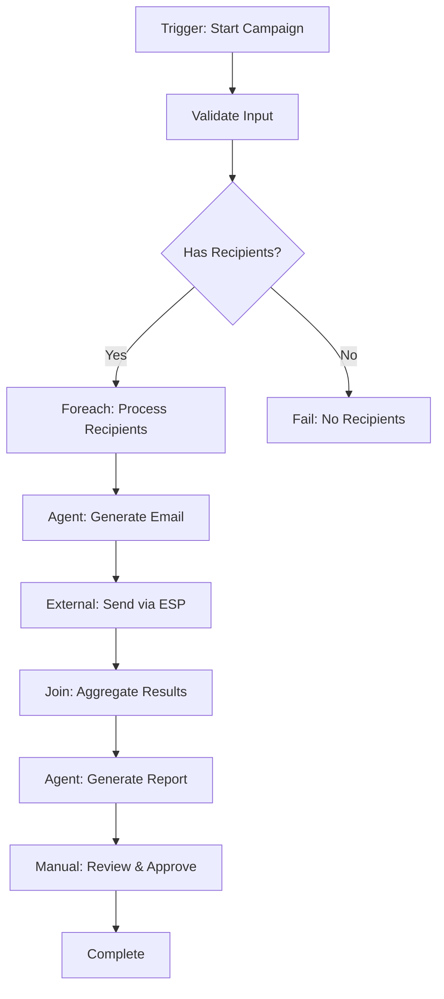

# Workflow Execution System

This document describes how workflows execute in the Coordination Matrix system, including task creation, execution modes, and the role of the automation daemon.

## Overview

The workflow execution system follows an **event-driven architecture**:

```
┌─────────────────────────────────────────────────────────────────────────┐
│                        WorkflowExecutionService                          │
│  - Creates workflow runs and tasks                                       │
│  - Listens for task.status.changed events                               │
│  - Advances to next step when tasks complete                            │
└─────────────────────────────────────────────────────────────────────────┘
                                    │
                                    ▼
┌─────────────────────────────────────────────────────────────────────────┐
│                            Event Bus                                     │
│  task.created, task.status.changed, task.updated                        │
└─────────────────────────────────────────────────────────────────────────┘
                                    │
                    ┌───────────────┼───────────────┐
                    ▼               ▼               ▼
              ┌──────────┐   ┌──────────┐   ┌──────────┐
              │  Daemon  │   │   User   │   │ Webhook  │
              │ (agents) │   │   (UI)   │   │ Callback │
              └──────────┘   └──────────┘   └──────────┘
```

## Starting a Workflow

### API Endpoint

```http
POST /api/workflow-runs
Content-Type: application/json

{
  "workflowId": "674abc123...",
  "inputPayload": {
    "emails": ["user1@example.com", "user2@example.com"],
    "template": "welcome"
  },
  "taskDefaults": {
    "assigneeId": "674def456...",
    "urgency": "high",
    "tags": ["batch", "email-campaign"]
  },
  "externalId": "campaign-2024-001",
  "source": "api"
}
```

### Response

```json
{
  "data": {
    "run": {
      "_id": "674xyz789...",
      "workflowId": "674abc123...",
      "status": "running",
      "rootTaskId": "674task001...",
      "currentStepIds": ["step-1"],
      "completedStepIds": [],
      "inputPayload": { ... },
      "taskDefaults": { ... }
    },
    "rootTask": {
      "_id": "674task001...",
      "title": "Workflow: Email Campaign",
      "status": "in_progress"
    }
  }
}
```

## Task Types & Execution

Each workflow step creates a task with a specific `taskType` and `executionMode`:

| Step Type | Task Type | Execution Mode | Who Completes It |
|-----------|-----------|----------------|------------------|
| `agent` | `standard` | `automated` | Daemon (runs AI/script) |
| `manual` | `standard` | `manual` | Human (via UI) |
| `external` | `external` | `external_callback` | Webhook callback |
| `decision` | `decision` | `immediate` | Auto (condition eval) |
| `foreach` | `foreach` | `automated` | Auto (creates children) |
| `join` | `join` | `automated` | Auto (waits for children) |
| `subflow` | `subflow` | `automated` | Nested workflow |

---

## Step Type Details

### 1. Agent Steps (`automated`)

Agent steps are executed by the **Automation Daemon**. Configure the daemon with a YAML rule:

```yaml
# daemon-config.yaml
concurrency: 3
rules:
  - name: execute-agent-tasks
    enabled: true
    trigger:
      event: task.created
      filter: "executionMode:automated"
    action:
      command: "node scripts/run-agent.js {{task._id}}"
      timeout: 300000  # 5 minutes
      update_fields:
        status: "{{result.status}}"
        metadata: "{{result.metadata}}"
```

The daemon:
1. Listens for `task.created` events
2. Filters for `executionMode:automated`
3. Runs the configured command
4. Updates the task with results (including `status: completed`)
5. This triggers `task.status.changed` → workflow advances

**Agent Script Example:**

```javascript
// scripts/run-agent.js
const taskId = process.argv[2];

// Fetch task details
const task = await fetch(`http://localhost:3001/api/tasks/${taskId}`).then(r => r.json());

// Call AI/agent system
const result = await runAgent(task.data.extraPrompt, task.data.metadata?.inputPayload);

// Output JSON for daemon to parse
console.log(JSON.stringify({
  status: "completed",
  metadata: {
    agentOutput: result.output,
    tokensUsed: result.tokens
  }
}));
```

### 2. Manual Steps (`manual`)

Manual steps wait for a human to complete them via the UI.

**Task appears in the user's task list with:**
- `status: pending`
- `executionMode: manual`
- `assigneeId` (if set via taskDefaults or step config)

**User completes via API:**

```http
PATCH /api/tasks/{taskId}
Content-Type: application/json

{
  "status": "completed",
  "metadata": {
    "reviewNotes": "Approved with minor changes",
    "approvedBy": "John Doe"
  }
}
```

This triggers `task.status.changed` → workflow advances to next step.

### 3. External Steps (`external_callback`)

External steps wait for a webhook callback from an external system.

**When the step task is created:**
- `status: pending`
- `executionMode: external_callback`
- `externalConfig.callbackSecret` is generated

**Your system should:**
1. Read the task's `externalConfig.callbackSecret`
2. Call the external service with callback URL
3. External service calls back when done

**Callback Endpoint:**

```http
POST /api/workflow-runs/{runId}/callback/{stepId}
Content-Type: application/json
X-Workflow-Secret: wfsec_abc123...

{
  "success": true,
  "data": {
    "processedItems": 150,
    "errors": []
  }
}
```

**Response:**

```json
{
  "data": {
    "acknowledged": true,
    "taskId": "674task123...",
    "taskStatus": "completed"
  }
}
```

### 4. Decision Steps (`immediate`)

Decision steps auto-complete immediately by evaluating conditions.

**Workflow Definition:**

```json
{
  "id": "decide-priority",
  "name": "Route by Priority",
  "stepType": "decision",
  "connections": [
    { "targetStepId": "urgent-handler", "condition": "urgency:urgent" },
    { "targetStepId": "normal-handler", "condition": "urgency:normal" }
  ],
  "defaultConnection": "low-priority-handler"
}
```

**Condition Syntax:**
- `field:value` - exact match
- `field:value1,value2` - match any
- Values are extracted from `inputPayload` passed to the step

The decision task completes immediately with:
- `status: completed`
- `decisionResult: "urgent-handler"` (the selected path)

### 5. Foreach Steps (Fan-out)

Foreach steps create child tasks for each item in an array.

**Workflow Definition:**

```json
{
  "id": "process-each-email",
  "name": "Process Each Email",
  "stepType": "foreach",
  "itemsPath": "emails",
  "itemVariable": "email",
  "maxItems": 100,
  "connections": [
    { "targetStepId": "send-email" }
  ]
}
```

**Execution Flow:**

```
Input: { emails: ["a@x.com", "b@x.com", "c@x.com"] }
                        │
                        ▼
              ┌─────────────────┐
              │  Foreach Task   │ (status: waiting)
              │  expectedCount: 3│
              └─────────────────┘
                        │
         ┌──────────────┼──────────────┐
         ▼              ▼              ▼
    ┌─────────┐    ┌─────────┐    ┌─────────┐
    │ Child 1 │    │ Child 2 │    │ Child 3 │
    │email: a@│    │email: b@│    │email: c@│
    └─────────┘    └─────────┘    └─────────┘
```

Each child task receives:
- `metadata.inputPayload.email` = the current item
- `metadata.inputPayload._index` = 0, 1, 2...
- `metadata.inputPayload._total` = 3

### 6. Join Steps (Fan-in)

Join steps wait for all children of a foreach to complete.

**Workflow Definition:**

```json
{
  "id": "aggregate-results",
  "name": "Aggregate Results",
  "stepType": "join",
  "awaitStepId": "process-each-email"
}
```

**Execution Flow:**

```
         Child 1 ──┐
         (done)    │
                   │
         Child 2 ──┼──▶ Join Task checks:
         (done)    │    - All children done?
                   │    - Aggregate results
         Child 3 ──┘    - Complete & advance
         (done)
```

When complete, the join task has:
- `status: completed`
- `metadata.aggregatedResults`: array of child task metadata
- `metadata.successCount`: number of successful children
- `metadata.failedCount`: number of failed children

---

## Task Flow & Event Handling

### Event: `task.status.changed`

The `WorkflowExecutionService` subscribes to this event:

```typescript
eventBus.subscribe('task.status.changed', async (event: TaskEvent) => {
  // Only process workflow tasks
  if (!task.workflowRunId || !task.workflowStepId) return;

  // Only on completed or failed
  if (task.status !== 'completed' && task.status !== 'failed') return;

  // Advance workflow
  await this.advanceToNextStep(run, workflow, task);
});
```

### Advancing to Next Step

When a task completes:

1. **Mark step as completed** in the workflow run
2. **Find next step(s)** from connections or sequential order
3. **Pass output forward** - completed task's `metadata` becomes next step's `inputPayload`
4. **Create next task(s)** - with taskDefaults applied

```
Step 1 Task                    Step 2 Task
┌──────────────────┐          ┌──────────────────┐
│ status: completed│   ──▶    │ status: pending  │
│ metadata: {      │          │ metadata: {      │
│   output: "..."  │          │   inputPayload:  │
│ }                │          │     output: "..."|
└──────────────────┘          └──────────────────┘
```

---

## Workflow Run Lifecycle

```
┌─────────┐     ┌─────────┐     ┌───────────┐     ┌───────────┐
│ pending │ ──▶ │ running │ ──▶ │ completed │  or │  failed   │
└─────────┘     └─────────┘     └───────────┘     └───────────┘
     │               │                                  ▲
     │               │          ┌───────────┐           │
     │               └────────▶ │ cancelled │           │
     │                          └───────────┘           │
     │               │                                  │
     │               └─────── (step fails) ─────────────┘
     │               │
     │               └────────▶ ┌────────┐
     │                          │ paused │
     │                          └────────┘
     └── (immediate start)
```

### Status Meanings

| Status | Description |
|--------|-------------|
| `pending` | Created but not started |
| `running` | Actively executing steps |
| `paused` | Manually paused (future: pauseAtSteps) |
| `completed` | All steps finished successfully |
| `failed` | A step failed (see `error` and `failedStepId`) |
| `cancelled` | Manually cancelled via API |

---

## Monitoring Workflow Runs

### List Runs

```http
GET /api/workflow-runs?status=running&workflowId=674abc123...
```

### Get Run Details with Tasks

```http
GET /api/workflow-runs/{runId}?includeTasks=true
```

Returns the run plus all tasks created for it, allowing you to build a task tree view.

### Cancel a Run

```http
POST /api/workflow-runs/{runId}/cancel
```

Sets status to `cancelled` and stops further step execution.

---

## Configuration Reference

### Task Defaults

Applied to all tasks in a workflow run:

```json
{
  "taskDefaults": {
    "assigneeId": "user-id",       // Default task assignee
    "urgency": "high",             // low | normal | high | urgent
    "tags": ["batch", "automated"], // Tags applied to all tasks
    "dueOffsetHours": 24           // Due date = creation + N hours
  }
}
```

### Execution Options (Future)

```json
{
  "executionOptions": {
    "pauseAtSteps": ["step-3"],   // Pause before these steps
    "skipSteps": ["optional-step"], // Skip these steps entirely
    "dryRun": true                  // Simulate without creating tasks
  }
}
```

---

## Daemon Configuration

The automation daemon runs as a separate process and executes agent tasks.

### Starting the Daemon

```bash
cd backend
npm run daemon -- ./daemon-config.yaml
```

### Sample Configuration

```yaml
# daemon-config.yaml
concurrency: 5

rules:
  # Execute automated workflow tasks
  - name: workflow-agent-tasks
    enabled: true
    trigger:
      event: task.created
      filter: "executionMode:automated"
    action:
      command: "node scripts/run-agent.js {{task._id}}"
      timeout: 300000
      update_fields:
        status: "{{result.status}}"
        metadata: "{{result.metadata}}"

  # Handle external service calls
  - name: call-external-api
    enabled: true
    trigger:
      event: task.created
      filter: "executionMode:external_callback AND tag:needs-api-call"
    action:
      command: "node scripts/call-external.js {{task._id}}"
      timeout: 60000
```

### Template Variables

| Variable | Description |
|----------|-------------|
| `{{task._id}}` | Task ObjectId |
| `{{task.title}}` | Task title |
| `{{task.status}}` | Current status |
| `{{task.metadata}}` | Task metadata (JSON) |
| `{{event.type}}` | Event type |
| `{{result.fieldName}}` | Parsed from command JSON output |

---

## Error Handling

### Step Failure

When a task fails (`status: failed`):

1. Workflow run status → `failed`
2. `error` field set to step name
3. `failedStepId` set to the step ID
4. No further steps execute

### Retry Behavior

Currently, failed workflows must be manually restarted. Future enhancements may include:
- Automatic retry with backoff
- Manual "resume from failed step"
- Fallback step connections

---

## Example: Email Campaign Workflow



### Workflow Definition

```json
{
  "name": "Email Campaign",
  "steps": [
    {
      "id": "validate",
      "name": "Validate Input",
      "stepType": "agent",
      "prompt": "Validate the campaign configuration"
    },
    {
      "id": "check-recipients",
      "name": "Has Recipients?",
      "stepType": "decision",
      "connections": [
        { "targetStepId": "foreach-recipients", "condition": "recipientCount:>0" }
      ],
      "defaultConnection": "no-recipients"
    },
    {
      "id": "foreach-recipients",
      "name": "Process Recipients",
      "stepType": "foreach",
      "itemsPath": "recipients",
      "itemVariable": "recipient",
      "connections": [{ "targetStepId": "generate-email" }]
    },
    {
      "id": "generate-email",
      "name": "Generate Email",
      "stepType": "agent",
      "prompt": "Generate personalized email for {{recipient.name}}"
    },
    {
      "id": "send-email",
      "name": "Send via ESP",
      "stepType": "external"
    },
    {
      "id": "aggregate",
      "name": "Aggregate Results",
      "stepType": "join",
      "awaitStepId": "foreach-recipients"
    },
    {
      "id": "generate-report",
      "name": "Generate Report",
      "stepType": "agent",
      "prompt": "Create summary report from aggregated results"
    },
    {
      "id": "review",
      "name": "Review & Approve",
      "stepType": "manual"
    }
  ]
}
```
